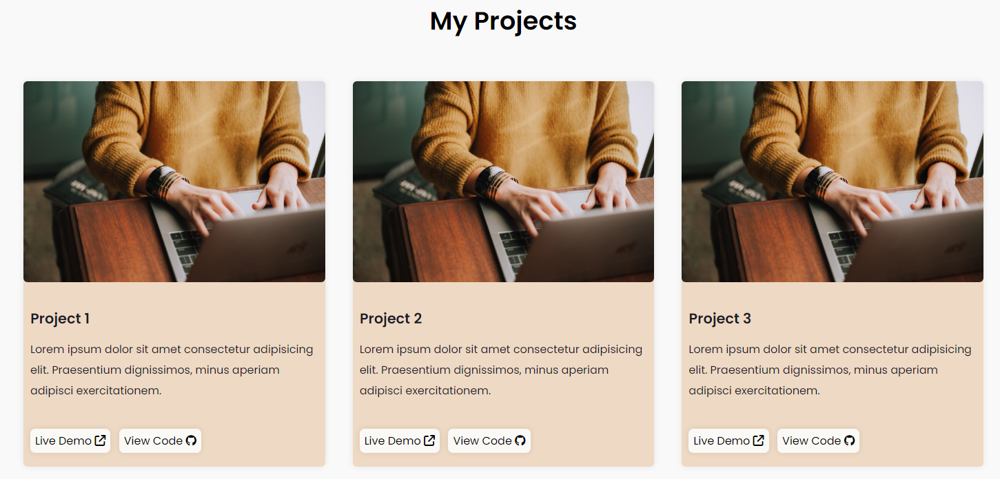
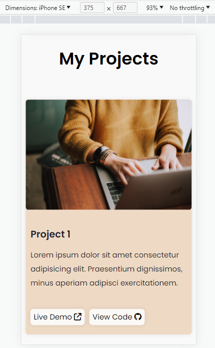

# My portfolio

## Overview

For my portfolio, I aimed for a clean, mobile-responsive design with a warm-tone colour scheme to be able to present my personal projects.

## Technologies Used

## Colour Scheme

 #1C1B29    
 #EED9C4

## Responsive Considerations

- Mobile first design
- Responsiveness achieved by:
  - Hamburger menu for mobile layout
  - Flex
  - Percentages and `Min(val1, val2)` for widths
  - Media Queries

  

## Accessibility Considerations

